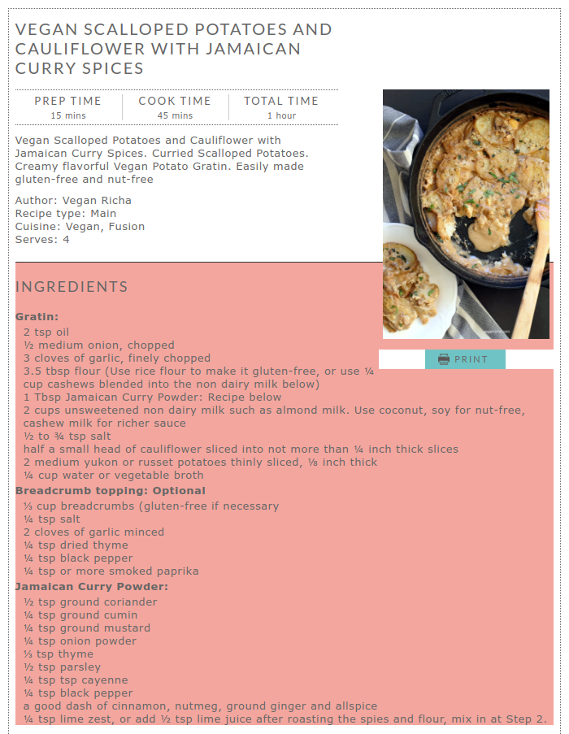
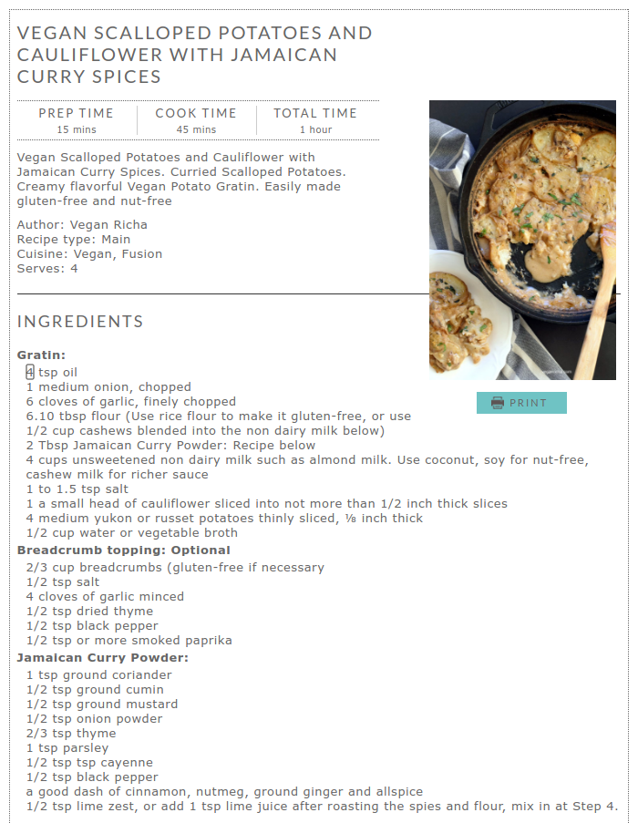

# Recipe adapter
This browser extension allows you to modify ingredient lists proportionally on the fly, so that you can adjust your meals for the people you plan to serve, saving you from having to manually calculate the final amount based on the original recipe.

## Supported browsers
The following browsers are currently supported:
- [Chrome and Chromium](https://chrome.google.com/webstore/detail/recipe-adapter/milammgjlcmebbiiikmbfjjlcjepdilg/)
- [Firefox](https://addons.mozilla.org/en-US/firefox/addon/recipe-adapter/)
- [Opera](https://addons.opera.com/en/extensions/details/recipe-adapter/)

Initially, the extension was targeted at the Chrome and Chromium browsers. Consequently, the extension's code is stored in the [chrome](chrome) directory. Fortunately, Firefox and Opera support of Chrome's APIs is very decent, and not a single modification was needed in order for the extension to be ported into those browsers. That's why no specific directories exist for them.

## How it works
Once you have installed the extension on your browser, click on its icon to start using the tool. The cursor will be now a selector: just hover the mouse over the page and pick the proper box so that it contains the list of ingredients. If you cannot fit all the ingredients in one go, just click on the extension's icon again and pick another box. Once you have done this, you will be able to freely modify the ingredient quantities to adjust them to your needs.

As an example (from [veganricha.com](http://www.veganricha.com/)), the selection process will look like this:

After duplicating the quantities of the ingredients (by multiplying by 2 the first ingredient on the list, for example), you will see something like this:

