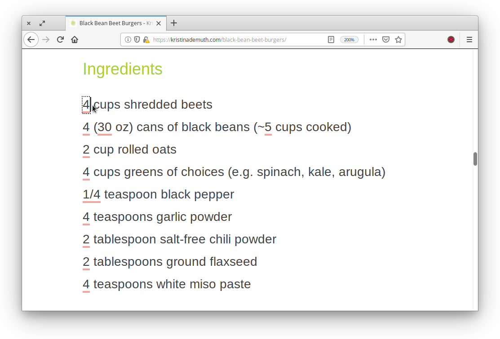

# Recipe adapter
A browser extension that lets you modify intredient quantities of recipes you find on the web, proportionally, to adjust them to any number of people.

Please, feel free to support my work with a small contribution... 🙂

## Supported browsers
- [Chrome and Chromium](https://chrome.google.com/webstore/detail/recipe-adapter/milammgjlcmebbiiikmbfjjlcjepdilg/)
- [Firefox](https://addons.mozilla.org/en-US/firefox/addon/recipe-adapter/)
- [Opera](https://addons.opera.com/en/extensions/details/recipe-adapter/)

## How it works
While looking at a recipe in your favorite blog...
1. Click on the extension's icon to start using it.
2. Select the list of ingredients. If you cannot fit all the ingredients in one go, repeat steps 1 and 2 until all are selected.
3. Change any of the quantities on it – all the others will adapt automatically!

As an example (from [Kristina DeMuth's blog](https://kristinademuth.com/)), the process will look something like this:

